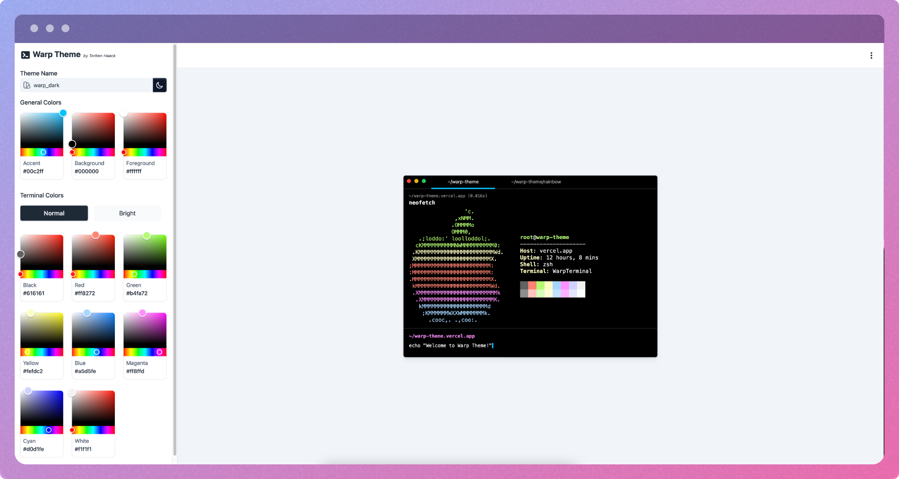

 

  
   
  A theme builder for <a href="https://warp.dev">Warp</a>
  

     
    <a href="https://warp-theme.vercel.app"><strong>Try it out now ✨</strong></a>
     
    <a href="https://github.com/trbnhck/warp-theme/issues">Report Bug</a>
    ·
    <a href="https://github.com/trbnhck/warp-theme/issues">Request Feature</a>
  

## Preview

## Roadmap

- [ ] Add Support for Background Images
- [ ] Add Support for Gradients

## Donate

If you want to support me, consider buying me a [☕️ Coffee](https://www.buymeacoffee.com/haack).
Every donation is highly appreciated.

## Contributing

Contributions are what make the open source community such an amazing place to learn, inspire, and create. Any contributions you make are **greatly appreciated**.

If you have a suggestion that would make this better, please fork the repo and create a pull request. You can also simply open an issue with the tag "enhancement".
Don't forget to give the project a star! Thanks again!

1. Fork the Project
2. Create your Feature Branch (`git checkout -b feature/AmazingFeature`)
3. Commit your Changes (`git commit -m 'Add some AmazingFeature'`)
4. Push to the Branch (`git push origin feature/AmazingFeature`)
5. Open a Pull Request

## Contact
[@torben_haack](https://twitter.com/torben_haack) – haack.t@icloud.com

(<a href="#readme-top">back to top</a>)

